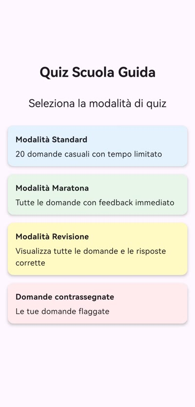
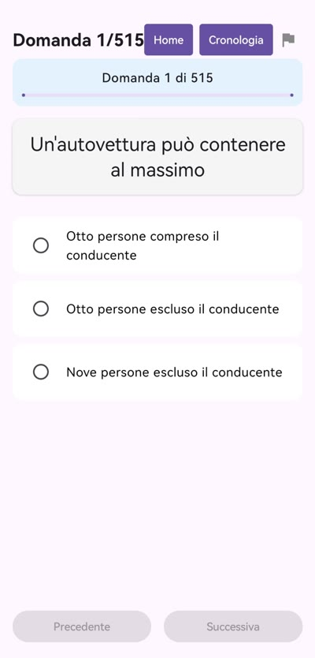
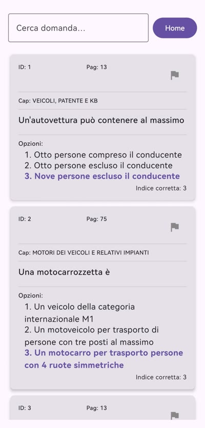
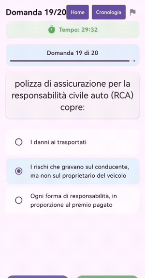
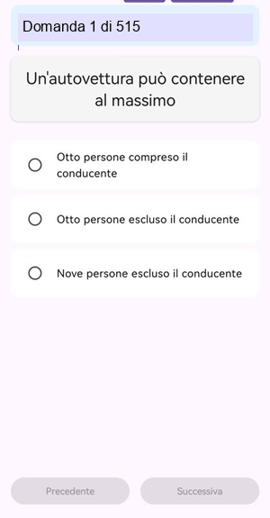

# Test NCC - Professional Driving License

A modern Android app for preparing for the NCC (Noleggio con Conducente - Hire Car with Driver) professional driving license exam with an intuitive interface and comprehensive study features.

## Overview

The Test NCC app was developed to help candidates effectively prepare for the NCC professional driving license exam. It offers various study modes, bookmarked questions management, and a comprehensive review system.

### Key Features

- **Quiz Mode**: Timed practice sessions with immediate feedback
- **Marathon Mode**: Continuous study without time limits
- **Review Mode**: Browse all questions with detailed explanations
- **Bookmark System**: Save important questions for review
- **Personal Progress**: Track your improvements over time

## App Screenshots

### Study Mode Selection


*Choose from different modes: Standard Quiz, Marathon Mode, Review Mode, or Flagged Questions*

### Interactive Quiz Interface


*Clean, intuitive interface for answering NCC driving license questions*

### Review Mode


*Browse and search through all questions with detailed explanations*

### Flagged Questions Management


*Keep track of questions that need additional review*

## Feature Demonstrations

### Quiz Mode Demo


*Experience the timed quiz mode with immediate feedback*

### Marathon Mode Demo


*Practice with continuous question flow for comprehensive study*

## Technologies Used

### Framework and Languages
- **Kotlin**: Modern programming language for Android
- **Jetpack Compose**: Modern UI toolkit for native interfaces
- **Android SDK**: Native Android development platform

### Architecture
- **MVVM Pattern**: Clean separation between business logic and UI
- **Repository Pattern**: Centralized data management
- **Reactive Programming**: Reactive interface with StateFlow/LiveData

### Main Libraries
- **Jetpack Compose**: Modern declarative UI
- **Material Design 3**: Google design system for visual consistency
- **Kotlin Coroutines**: Efficient asynchronous programming
- **ViewModel & LiveData**: Lifecycle-aware UI state management

## Project Structure

```
app/src/main/java/com/example/test_ncc_2/
├── model/
│   ├── Question.kt              # Question data model
│   ├── TestResult.kt            # Quiz results
│   └── TestResultRepository.kt  # Data management repository
├── viewmodel/
│   └── QuizViewModel.kt         # Quiz logic ViewModel
├── ui/theme/
│   ├── Color.kt                 # Color palette
│   ├── Theme.kt                 # Theme configuration
│   └── Type.kt                  # Typography
└── MainActivity.kt              # Main activity
```

## Detailed Features

### Smart Quiz System
- **Question Randomization**: Random order to avoid mechanical memorization
- **Configurable Timer**: Real exam condition simulation
- **Immediate Feedback**: Detailed explanations for each answer
- **Progress Statistics**: Accuracy and response time tracking

### Personalized Study Management
- **Bookmark System**: Save difficult questions
- **Advanced Filters**: Search by topic or difficulty
- **Answer History**: Review previous mistakes
- **Offline Mode**: Study without internet connection

### Interface Design
- **Material Design 3**: Modern and accessible interface
- **Dark/Light Theme**: Automatic system theme support
- **Responsive Layout**: Optimized for different screen sizes
- **Smooth Animations**: Fluid transitions between screens

## System Requirements

- **Android**: Version 7.0 (API level 24) or higher
- **RAM**: 2GB minimum recommended
- **Storage**: 50MB available space
- **Connection**: Optional (app works offline)

## Installation

### From Source Code

1. **Clone Repository**
```bash
git clone https://github.com/Yassir00000/test-driving-licence-ncc-android-app.git
cd test-driving-licence-ncc-android-app
```

2. **Open in Android Studio**
   - Launch Android Studio
   - Select "Open an existing project"
   - Navigate to the project folder

3. **Build and Run**
   - Sync Gradle dependencies
   - Connect Android device or start emulator
   - Click "Run" to install the app

### Development Setup
```bash
# Verify Android SDK installation
android --version

# Build debug version
./gradlew assembleDebug

# Run tests
./gradlew test
```

## App Usage

### First Launch
1. **Mode Selection**: Choose between Quiz, Marathon, or Review
2. **Configuration**: Set timer and number of questions (Quiz mode)
3. **Start Studying**: Begin your preparation session

### Study Modes

**Quiz Mode**
- Timed sessions with fixed number of questions
- Real exam condition simulation
- Final result with success percentage

**Marathon Mode** 
- Continuous study without time limits
- Ideal for thorough review
- Progress automatically saved

**Review Mode**
- Free consultation of question database
- Keyword search
- Access to complete explanations

## Development and Contributions

### Technical Skills Demonstrated
This project showcases competencies in:
- **Native Mobile Development**: Android with modern Kotlin
- **UI/UX Design**: Intuitive interfaces with Material Design
- **Architecture Patterns**: MVVM, Repository, Clean Architecture
- **Performance Optimization**: Memory management and battery-efficient code

### Implemented Best Practices
- **Clean Code**: Readable and maintainable code
- **Testing**: Unit tests for business logic
- **Documentation**: Code comments and documentation
- **Version Control**: Git workflow with semantic commits

## License

Project developed for educational purposes and demonstration of technical skills in Android development.

## Contact

**Developer**: Yassir - [GitHub Profile](https://github.com/Yassir00000)

---

*App developed with Kotlin and Jetpack Compose for NCC professional driving license exam preparation*